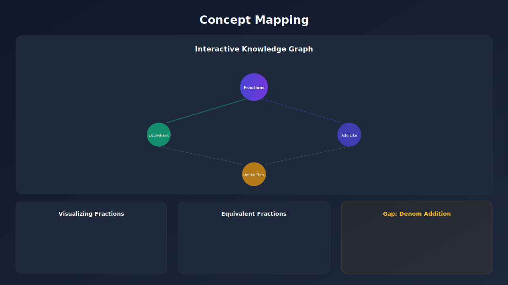
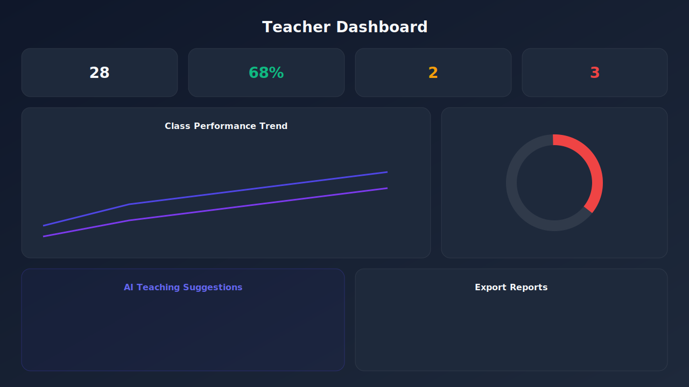

<div align="center">


<br/>

<p align="center">
  
  
  
  
</p>

<p align="center">
  
  
  
  
</p>

<p align="center">
  
  &nbsp;
  
  &nbsp;
  
  &nbsp;
  
</p>

<br/>

### 🔍 Identify Knowledge Gaps &nbsp;·&nbsp; 📊 Adaptive Assessments &nbsp;·&nbsp; 🗺️ Visual Concept Maps &nbsp;·&nbsp; 🤖 AI Tutoring

<br/>

<a href="#">
  
</a>
&nbsp;&nbsp;
<a href="https://github.com/rohan1460/Gap-Learning-AI/issues">
  
</a>
&nbsp;&nbsp;
<a href="https://github.com/rohan1460/Gap-Learning-AI/issues">
  
</a>

</div>

<br/>

---

## 💡 What is GapLearning AI?

> **Most learning platforms tell you *what* you got wrong. GapLearning AI tells you *why*.**

GapLearning AI is a full-stack **adaptive educational SaaS platform** that uses AI to detect knowledge gaps at the concept level — not just the question level. It identifies the exact misconception behind every wrong answer, then rebuilds a personalized learning path from the ground up.

<table>
<tr>
<td width="50%">

**Traditional Platforms** ❌
- Mark answers right or wrong
- Show the correct answer
- Give the same content to everyone
- No insight into *why* a student struggles

</td>
<td width="50%">

**GapLearning AI** ✅
- Diagnoses misconceptions from distractors
- Uses Socratic AI to guide discovery
- Adapts difficulty + topic in real-time
- Generates concept maps & learning paths

</td>
</tr>
</table>

---

## 🖼️ Screenshots

### 🏠 Landing Page
<div align="center">
  
</div>

<br/>

### 📊 Student Dashboard & Assessment
<div align="center">
  <table>
    <tr>
      <td align="center" width="50%">
        
        <br/><b>Student Dashboard</b>
      </td>
      <td align="center" width="50%">
        
        <br/><b>Adaptive Assessment</b>
      </td>
    </tr>
  </table>
</div>

<br/>

### 🗺️ Concept Mapping & Teacher Analytics
<div align="center">
  <table>
    <tr>
      <td align="center" width="50%">
        
        <br/><b>Interactive Concept Map</b>
      </td>
      <td align="center" width="50%">
        
        <br/><b>Teacher Analytics Dashboard</b>
      </td>
    </tr>
  </table>
</div>

---

## ✨ Feature Highlights

<details>
<summary><b>👨‍🎓 Student Portal</b></summary>
<br/>

| Feature | What it does |
|---|---|
| 🔍 **AI Gap Detection** | Identifies specific misconceptions from each wrong answer choice |
| 📊 **Adaptive Assessments** | Dynamic difficulty, timer, and smooth question navigation |
| 🗺️ **Interactive Concept Map** | Visual knowledge graph showing dependencies and mastery levels |
| 🤖 **Socratic AI Tutor** | Conversational Gemini-powered guide that asks questions instead of giving answers |
| 🎮 **Gamification System** | XP, levels, streaks, and achievement badges to keep motivation high |
| 🛣️ **Personalized Learning Path** | AI-generated next steps ranked by your weakest prerequisite gaps |
| 📋 **Detailed Diagnostic Report** | Confidence scores, mastery breakdown, and targeted feedback per concept |

</details>

<details>
<summary><b>👩‍🏫 Teacher Portal</b></summary>
<br/>

| Feature | What it does |
|---|---|
| 📈 **Class Analytics Dashboard** | Overview of student count, mastery rates, and most common gaps |
| 📉 **Performance Charts** | Line, bar, and pie charts (Recharts) for visual data storytelling |
| ⚠️ **At-Risk Detection** | Lists struggling students with their specific misconceptions highlighted |
| 💡 **AI Teaching Suggestions** | Gemini-generated remediation strategies tailored per subject gap |
| 📄 **Worksheet Generator** | Auto-generates targeted practice sheets for identified misconceptions |
| 📥 **Export Reports** | Download class performance summaries for sharing or record-keeping |

</details>

---

## 🧠 How the Adaptive Engine Works

The core intelligence is **fully offline** — no database or API key required. Gemini enhances it optionally for tutoring and worksheets.

```
Student answers a question
         │
         ├──✅ CORRECT ──► Increase difficulty → Advance to next concept
         │
         └──❌ WRONG ────► Identify misconception from distractor tag
                           │
                           ├── Lower difficulty
                           ├── Return to weakest prerequisite concept
                           └── Log gap with confidence penalty
                                        │
                              ┌─────────▼──────────┐
                              │  Mastery Estimator │
                              │  (weighted scoring) │
                              └─────────┬──────────┘
                                        │
                              ┌─────────▼──────────┐
                              │   Final Report      │
                              │  Gaps · Paths · XP  │
                              └────────────────────┘
```

**Key properties of the engine:**
- 🏷️ Every question tagged: concept, difficulty, prerequisites, objective, misconception distractors
- 📐 Mastery uses difficulty-weighted scoring with a neutral Bayesian prior
- 🔁 Stateless between sessions — no backend needed for the prototype
- 📋 Output: strengths, weaknesses, confidence scores, ordered learning path, next assessment

---

## 🛠️ Tech Stack

<div align="center">

| Layer | Technology | Purpose |
|---|---|---|
| ⚛️ UI Framework | React 19 + TypeScript | Component-driven, type-safe frontend |
| ⚡ Build Tool | Vite 8 | Lightning-fast dev server and builds |
| 🎨 Styling | Tailwind CSS 4 | Utility-first responsive design |
| 🎞️ Animation | Framer Motion | Smooth page & micro-interactions |
| 📊 Charts | Recharts | Analytics visualizations |
| 🔣 Icons | Lucide React | Consistent icon system |
| 🔀 Routing | React Router DOM | SPA client-side navigation |
| 🤖 AI Layer | Google Gemini 2.5 Flash | Tutoring, suggestions, worksheets |
| 🚀 Hosting | Vercel | Zero-config CI/CD deployment |

</div>

---

## 🎨 Design System

The UI follows a **dark glassmorphism** aesthetic with indigo-purple gradients.

<div align="center">

| Token | Hex | Visual |
|:---:|:---:|:---:|
| Primary | `#4F46E5` |  |
| Secondary | `#7C3AED` |  |
| Background | `#0F172A` |  |
| Surface | `#1E293B` |  |
| Text | `#F8FAFC` |  |

</div>

Patterns used: glassmorphism cards · gradient backgrounds · skeleton loaders · empty states · fully responsive at all breakpoints

---

## 🚀 Getting Started

### Prerequisites

- **Node.js** v18 or higher
- **npm** or **yarn**

### Local Setup

```bash
# 1. Clone the repo
git clone https://github.com/rohan1460/Gap-Learning-AI.git
cd Gap-Learning-AI

# 2. Install dependencies
npm install

# 3. Start the dev server
npm run dev
```

Open **http://localhost:5173** — the app runs fully without any API key.

### 🤖 Enable Live AI Features (Optional)

| Step | Action |
|---|---|
| 1 | Get a free key at [aistudio.google.com/apikey](https://aistudio.google.com/apikey) |
| 2 | Open the Student or Teacher Portal |
| 3 | Click the ⚙️ settings toggle and paste your key |
| 4 | Key is stored **only in your browser** — never sent to any server |

### 📦 Build for Production

```bash
npm run build      # Creates optimized build in /dist
npm run preview    # Preview production build locally
```

---

## 📂 Project Structure

```
Gap-Learning-AI/
│
├── public/
│   └── screenshots/              # App preview images
│       ├── landing-page.svg
│       ├── student-dashboard.svg
│       ├── assessment-module.svg
│       ├── concept-mapping.svg
│       └── teacher-dashboard.svg
│
├── src/
│   ├── adaptive/                 # 🧠 Core AI engine
│   │   ├── data/                 #    Knowledge graph + question bank (JSON)
│   │   ├── engines/              #    Question · Gap · Feedback · Report logic
│   │   ├── AdaptiveAssessmentEngine.ts   # Session orchestrator
│   │   ├── models.ts             #    TypeScript contracts
│   │   └── index.ts              #    Public API export
│   │
│   ├── components/
│   │   ├── assessment/           # Quiz UI, timer, progress bar, summary
│   │   ├── concept-map/          # Interactive SVG knowledge graph
│   │   ├── dashboard/            # Stat cards, activity timeline, charts
│   │   ├── landing/              # Hero, features, testimonials, CTA
│   │   ├── layout/               # Navbar, footer, page wrappers
│   │   ├── teacher/              # Teacher analytics & action panels
│   │   └── ui/                   # Design system: Button, Card, Badge, Modal
│   │
│   ├── pages/                    # Route-level page components
│   ├── services/                 # Gemini AI + mock fallback layer
│   ├── types/                    # Shared TypeScript types
│   └── utils/                    # Formatters, helpers, constants
│
├── vercel.json                   # SPA routing for Vercel
├── vite.config.ts
└── README.md
```

---

## ☁️ Deployment

### Deploy to Vercel (Recommended)

```bash
# Via CLI
npm i -g vercel
vercel

# Or push to GitHub and import at vercel.com/new
# Vercel auto-detects Vite — zero config needed ✅
```

> ⚠️ **Security note:** The Gemini API key is entered client-side for prototype purposes. For production, consider a serverless proxy to keep keys private.

---

## 🛣️ Roadmap

```
v1.0  ✅  Core adaptive engine + student & teacher portals
v1.1  🔲  User authentication (Firebase / Auth0)
v1.2  🔲  Cloud progress persistence (Supabase)
v1.3  🔲  Real-time collaborative concept maps
v2.0  🔲  Mobile app (React Native)
v2.1  🔲  Multi-language support (i18n)
v2.2  🔲  LMS integrations (Google Classroom, Canvas)
v3.0  🔲  ML-based gap prediction model
v3.1  🔲  Parent/guardian progress reports
```

---

## 🤝 Contributing

Contributions, issues, and feature requests are welcome!

```bash
# Fork the repo, then:
git checkout -b feature/your-feature-name
git commit -m "feat: add your feature"
git push origin feature/your-feature-name
# Open a Pull Request 🎉
```

**Contribution guidelines:**
- ✅ TypeScript for all new files
- ✅ Follow component patterns in `src/components/ui/`
- ✅ Keep components small and reusable
- ✅ Test at mobile, tablet, and desktop breakpoints
- ✅ Run `npm run lint` before pushing

---

## 📄 License

This project is licensed under the **MIT License** — free to use for portfolios, hackathons, and learning projects.  
See [LICENSE](LICENSE) for details.

---

<div align="center">


**Made with ❤️ by [Rohan](https://github.com/rohan1460)**

*Building the future of personalized education — one gap at a time.*

<br/>

⭐ **If GapLearning AI helped you, please star this repo!** ⭐  
*It keeps the project alive and motivates further development.*

</div>
